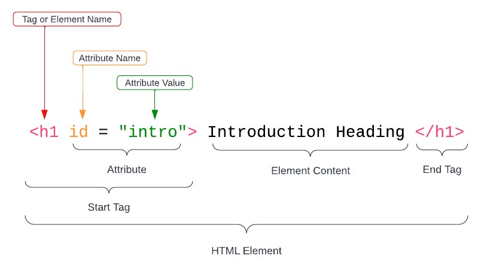
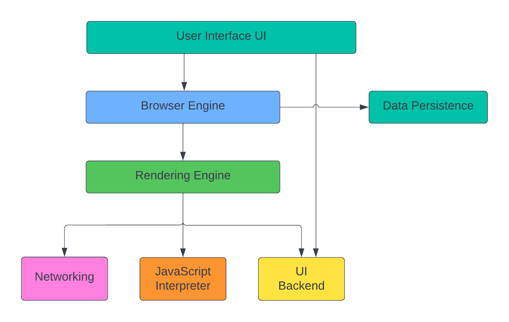
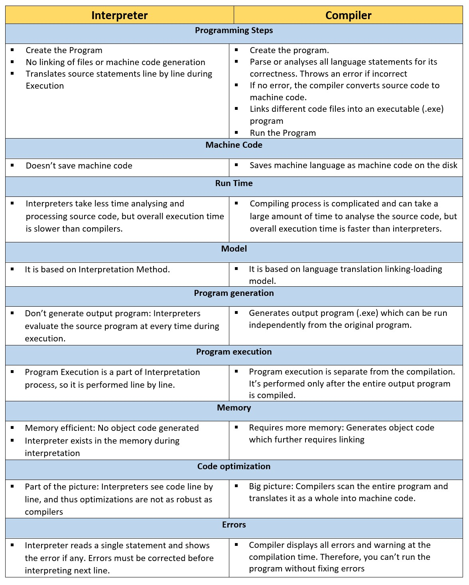
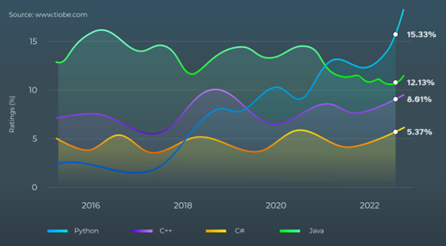
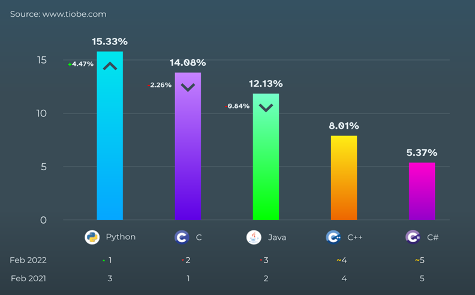
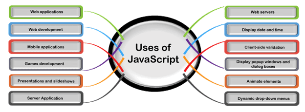

# T1A1-Workbook

---

## Q1: **Identify** and **explain** common and important components and concepts of web development markup languages.

<br>

#### 💲 __Solution__

The first thing you see when visiting a particular website is a web page or document. These web pages contain markup 
languages such as Hypertext Markup Language (HTML). A website designer or front-end developer will use HTML to structure
and describe the content within these web pages.
 
An essential concept for markup languages such as HTML is that the nesting of HTML Elements defines the structure of an 
HTML document to form a hierarchy.
 
An HTML Element structure includes a "Start tag", a "Tag Name", and an "Attribute Name" with an "Attribute Value" of 
the "Element Content" (the text affected by the tag meaning) and the element's "End Tag". Elements are either 
block-level elements or inline elements. Figure 1 shows the anatomy of an HTML Element.



Figure-1 Anatomy of an HTML Element

---


## Q2:	**Define** the features of the following technologies that are essential in terms of the development of the internet:
 - packets
 - IP addresses (IPv4 and IPv6)
 - routers and routing
 - domains and DNS

> **Explain** how each technology has contributed to the development of the internet.

<br>

#### 💲 __Solution__


### Packets:

The information transferred from one computer to another does not have to follow a fixed path, and the way for data 
transfer can change during a computer-to-computer interaction. Information goes from one computer to another in a 
"Packet" of information, and packet delivery depends upon network traffic on the route the packet is taking 
(Code.org, 2015, 0:01:27).

A Packet is a small segment of more extensive digital information or data, such as Music or Video. When data is sent 
over a computer network, such as the Internet, it is divided into pieces where the pieces might take different paths 
(Code.org, 2015, 0:02:19). Packets do not choose their route but have the IP address of where they are coming from and 
where they are going. Still, ultimately all packets arrive at their destination, where the packet data is recombined by
the device that receives them (Nimkarde, 2018).

<br>

### IP Addresses (IPv4 and IPv6):

One of the most essential Protocols used in internet communication is the Internet Protocol or IP. An IP is a set of 
rules and standards used to communicate between machines, such as computers (Viles, 2022). Every computer is assigned a 
unique set of IP numbers to form an IP Address to send and receive data or Packets (Code.org, 2015, 0:03:01).

When you visit a website, your computer asks another computer on the network for information. Your computer sends a 
message to the other computer's IP Address along with its origin IP Address so the receiving computer knows where to 
send its response (Nimkarde, 2018).

Your computer currently has two IP Addresses, IPv4, an IP address standard established in the 1970s and IPv6, a new 
standard for IP Addresses. IPv4 is a 32-bit numbered address widely adopted in the 1980s and is a stable IP address 
standard for identifying over 4 billion devices on the internet (Code.org, 2015, 0:03:35). 

Due to the internet's popularity, the IP Address standard is transitioning from IPv4 to a new IP address standard 
called IPv6, a longer IP address format resulting in a 128-bit numbered address to provide a more significant amount of 
unique IP addresses for the increase of connected devices and the ongoing development of the internet 
(Code.org, 2015, 0:04:04).


<br>

### Routers and Routing:

Routers are special computers that act like internet traffic managers, keeping the packets moving through the networks 
smoothly by forwarding data packets between computer networks. As part of the Internet Protocol, each Router keeps 
track of multiple paths for sending packets and are connected to at least two paths at any given time 
(Code.org, 2015, 0:03:07).

Individual packets travel different routes through the internet if one route is congested. A Router will choose the 
most time-effective paths available for each piece of data based on the destination IP address for each Packet 
(Code.org, 2015, 0:03:34).

Factors that affect data routing are the relationship between companies and political roadblocks, so having multiple 
path options for sending data ensures the internet's reliability in data delivery (Code.org, 2015, 0:04:01).


<br>

### Domains and DNS:

Cloudflare (2019) describes the Domain Name System (DNS) as "the phonebook of the internet". Whenever we need to access 
information online, we first must identify the source of information, namely the website, to get information.

DNS associates the name of a website, such as `www.randomwebsite.com`, with corresponding IP addresses. 
Your computer uses DNS to look up Domain Names and get the associated IP Address used to connect your computer to the 
website on the internet (Code.org, 2015, 0:04:36).

The Domain Name System uses special computers called DNS servers, which are connected in a distributed hierarchy and 
divided into zones. The divided zones split up the responsibility in terms of better control over DNS components for 
the major Domains, such as .org, .com, .net, and .edu.

---


## Q3:	**Define** the features of the following technologies that are essential in terms of the development of the internet:
 - TCP
 - HTTP and HTTPS
 - web browsers (requests, rendering and developer tools)

> **Explain** how each technology has contributed to the development of client and server communication over the internet (50 - 150 words for each technology)

<br>

#### 💲 __Solution__


### Transmission Control Protocol (TCP):

__Transmission Control Protocol__ or __TCP__ manages the sending and receiving all your data as packets. When data 
packets arrive at your address, TCP checks if all packets have arrived and send back acknowledgements of each packet 
received. If all packets have been received, TCP signs off on only the complete packet delivery to ensure no data is 
lost (Code.org, 2015, 00:04:17). 

Actualizare (2022) describes TCP as providing a "reliable stream delivery of data between Internet hosts". 
In other words, the TCP system ensures that the data is undamaged, not lost or duplicated or out of order during its 
transit through the network. The TCP system is scalable, and to ensure the quality of client-server communication, 
TCP follows industry operating characteristics such as basic data transfer, reliability, flow control, multiplexing, 
connections, and precedence and security (Actualizare 2022).

<br>

### HTTP and HTTPS:

__Hypertext Transfer Protocol__ or __HTTP__ is an application protocol that expresses a formatted webpage to the web 
browser. We could think of HTTP as a language used to convey information between web browsers and servers.
The client (web browser) issues some commands to talk to a server (website), and in milliseconds that server starts to 
talk back to the client in HTTP (Goralski, 2017, p. 671).

The flexibility of the HTTP mechanism for transporting web content allows for the ongoing evolution of client-server 
communication. Markup languages such as hypertext markup language (HTML), cascading style sheets (CSS), and programming
languages are easily integrated with the HTTP method. HTTP is, however, an unsecured mechanism of communication between 
the client and server and requires a more secure connection, such as Hypertext Transfer Protocol Secure or HTTPS, to 
protect integrity and privacy during client-server data transfer (Goralski, 2017, p. 672). 

<br>

### Web browsers (Request, Rendering and Developer Tools):

Wikipedia (2022) describes a Web browser as an "application software for accessing websites". Web browsers are built of 
frontend and backend technologies and work in a coordinated attempt at delivering a seamless web experience to the user.
Figure 2 shows the technologies and architecture of a web browser.

<br>



Figure-2 Web browser architecture


<br>


Web browsers play a pivotal role in accessing information on the internet. A user directly interacts with the web 
browser on their device via the User Interface (UI). UI is responsible for the visual elements of the browser, such as
input controls (dropdown list), navigation (search fields), and information components (notifications); without the UI,
for a general user, it would not be easy to interact with a computer system (Garrett, 2010).

Upon requesting content such as a webpage through the browser's UI, the rendering engine retrieves the content of the 
requested webpage. At the same time, the browser renders the requested content, such as HTML and XML elements and 
images styled using CSS, in the webpage to form the visual content displayed in the desired order or layout 
(Unadkat, 2022).

In addition to the web browser's ability to render retrieved content, most browsers include developer tools and 
generally appear alongside the rendered webpage within the browser. A developer uses developer tools for the design and 
engagement of webpages, and end users' engagement is a critical factor when designing webpages. Developers usually 
follow webpage and website design principles; developer tools are a powerful way to inspect, debug, emulate, and check 
the performance of webpages (Microsoft, 2022).


---


## Q4:	**Identify** THREE data structures used in the Python programming language and **explain** the reasons for using each.

<br>

### 💲 __Solution__

The following three data structures can be used in various ways to store, retrieve and manipulate data in Python.
	
1. __Lists:__ A collection of items that are ordered and changeable. They are written with square brackets [] and can 
contain items of different types.
2. __Tuples:__ A collection of items that are ordered and unchangeable. They are written with round brackets () and can 
contain items of different types.
3. __Dictionaries:__ A collection of items that are ordered (Python 3.7 onwards), Mutable and indexed items. They are 
written with curly braces {} and contain key-value pairs.

<br>

### Python List:

```py
animals = ["wolf", "eagle", "penguin"]
```

In the above example, the variable `animals` is assigned a list of strings representing different species of animals. 
`Lists` in Python are ordered and changeable, meaning that the items in a list can be accessed by their index 
(i.e. their position in the list) and that the items in the list can be modified by adding or removing items from the 
list. 

The following are some operations that can be performed on a Python `list`. 

```py
# Access the first item in the list
print(animals[0])   
# output: wolf

# Modify the second item in the list
animals[1] = "dragon"
print(animals)      
# output: ["wolf", "dragon", "penguin"]

# Add an item to the end of the list
animals.append("hyena")
print(animals)      
# output: ["wolf", "dragon", "penguin", "hyena"]

# Search and remove an item from the list
animals.remove("penguin")
print(animals)     
# output: ["wolf", "dragon", "hyena"]
```

<br>

### Python Tuples:

In the following example, the variable `character` is assigned a `tuple` containing four items: a `string` representing 
the character's first name, a `string` representing the character's last name, an `integer` representing the character's 
age, and a `string` representing the movie the character is in. Tuples in Python are ordered and unchangeable, meaning 
that the items in a tuple are accessed by their index (i.e. their position in the tuple), but the items in the tuple 
cannot be modified.


```py
character = ("John", "McClane", 42, "Diehard")
```


```python
# Access the first item in the tuple
print(character[0])   
# output: John

# Access the last item in the tuple
print(character[-1])  
# output: Diehard

# Modifying an item in the tuple will throw back a TypeError as once a 
# tuple is declared, you cant add or change any values in it
character[1] = "Gruber"  
# output: TypeError: 'tuple' object does not support item assignment

# Tuple unpacking
fname, lname, age, movie = character
print(movie)  
# output: Diehard
```

<br>

### Python Dictionary:

In Python, a `dictionary` is a collection of Ordered (Python 3.7 onwards), Mutable, and indexed items. Each item in a 
dictionary has a `key-value` pair. Dictionaries are written using curly braces `{}` with comma-separated items. 
Dictionaries are helpful in situations where you want to store and retrieve data by using keys.

In the following example, the variable `character` is assigned to a `dictionary` containing four key-value pairs. 
The left side represents keys `name`, `age`, `address`, `phone`, and the right represents the values `John McClane`, 
`42`, `Nakatmoi Plaza`, `1800 101 101`, e.g. `key : value`

```python
character = {
    "name": "John McClane",
    "age": 42,
    "address": "Nakatomi Plaza",
    "phone": "1800 101 101"
}

# Accessing an element using Key name in []
print(character["name"]) 
# output: John McClane

print(character["age"])   
# output: 42


# Adding items to the dictionary
character["gender"] = "male"

# print updated dictionary
print(character)
# output: {'name': 'John McClane', 'age': 42, 'address': 'Nakatomi Plaza', 'phone': '1800 101 101', 'gender': 'male'}


# Updating an item in the dictionary
character["age"] = 45

# print updated dictionary
print(character)
# output: {'name': 'John McClane', 'age': 45, 'address': 'Nakatomi Plaza', 'phone': '1800 101 101', 'gender': 'male'}


# Deleting an item from the dictionary
del character["phone"]

# print updated dictionary
print(character)
# output: {'name': 'John McClane', 'age': 45, 'address': 'Nakatomi Plaza', 'gender': 'male'}

```


---


## Q5:	**Describe** the features of interpreters and compilers and how they are different.

<br>

#### 💲 __Solution__


Interpreters and Compilers convert high-level programming languages into a computer's elemental language, known as 
machine code; however, there are several essential differences between Interpreters and Compilers (TechTarget, 2018; 
Programiz, n.d).

The primary function of a __compiler__ is to create an executable program by translating a high-level programming language 
(source code) into a low-level programming language or machine code. An __interpreter__ can directly execute the 
instructions written in the high-level programming language without compiling or translating the programming language 
into machine code (Geeksforgeeks, 2022). Table-1 shows the difference between interpreters and compilers 
(Smith, 2022) .

<br>

#### Table-1: Difference between interpreters and compilers



---


## Q6:	**Identify** TWO commonly used programming languages and **explain** the benefits and drawbacks of each.

<br>

#### 💲 __Solution__

### Python:

Python is one of the most popular programming languages in modern software development. 
Founded in 1991 by Guido Van Rossum and maintained by the Python Software Foundation, Python has quickly become a 
widely-used and universal high-level programming language. An interesting fact is that Python was initially the concept 
of one person's work (Python Institute, n.d).

Python's presents across the web development industry is vast, and if we realize it or not, we have used a device with 
Python code in it at some point. From 2016 to 2022, Python's growth in popularity is evident (Figure-3); it also 
occupies the first position in the TIOBE Programming Community and PYPL PopularitY of Programming Language Indexes 
(Figure-4) for the top ten programming languages from 2021 to 2022 (Python Institute, n.d).

One of the significant __benefits__ of Python is that it is almost written in plain English (high-level language). 
Python uses few keywords with simple structure making it easy to read, suitable for an everyday development task or an 
excellent choice for implementing complex Python-based applications and internet services in the following industries 
(geeksforgeeks.org, 2022).

-	Data Science
-	Artificial intelligence
-	Machine learning
-	Computer science
-	Education
-	Computer vision and image processing
-	Medicine
-	Biology
-	Astronomy

Python's freely available and open-sourced but maintained to a very high industry standard by high level python 
development community, which means an almost unlimited source of reusable code in an open-sourced environment such as 
an extensive library database (Python Institute, n.d).

For all its greatness, Python has some __drawbacks__, namely mobile development, database access and the coders' 
ability to adapt to other programming languages after using Python.

Python is not used much for mobile development as iOS and Android do not support interpreter programming languages. 
However, several Python GUI frameworks on offer allow mobile device development of Python applications 
(Srivastava, 2022).

Database access using Python is underdeveloped when interacting with complex outdated computing software or legacy 
data (geeksforgeeks.org, 2022).

Python programmers find using other programming languages difficult to adapt to due to Python resembling human language
and the programmers' perception of different programming languages being challenging (Chowdhury, 2022).

<br>



Figure 3 - Python trend line from 2016 to 2022

<br>




Figure 4 - Python popularity scale 2021 to 2022


<br>


### JavaScript:

A popular programming language for web development is JavaScript. As of 2022, JavaScript dominates the web development 
industry, and developers agree that JavaScript is trending in the right direction (Raval, 2022).

Brendan Eich created JavaScript in 1995 in collaboration with Netscape Communications, initially designed for 
Netscape's flagship web browser as a scripting language. These days, JS has been integrated into almost every device 
containing some operating system, whether on a desktop, mobile device or even a smart TV (LaunchSchool, n.d).

JS is most famous for dynamic websites requiring client and serverside scripting and progressive web app development 
or websites that behave like a mobile app. Still, at its core, JavaScript makes an HTML page more interactive, and 
figure 5 shows some use cases for JavaScript (JavaTpoint, n.d).

<br>



Figure 5 - JavaScript use-cases

<br> 

JavaScript is a behemoth programming language with new features added or updated weekly. The benefits of implementing 
new features can increase speed or cut down on compilation, reduce server load by validating data within the browser, 
seamless integration with other programming languages, and the implementation of easy to comprehend syntax.

However, rapidly implementing new features and updates has drawbacks, such as Debugging; developers find it challenging 
to source the issue, as no errors are displayed in the browser. Client-side security; JavaScript code can be misused by 
impairing the security of transmitted data. Browser compatibility and Rendering; JS code must be tested on various 
browsers as new features are not supported. Moreover, if there are any errors in the code, the entire website's code 
can stop rendering; browsers thankfully can manage such mistakes (Rawoof, 2022).


---

## Q7:	**Identify** TWO ethical issues from the areas below and **discuss** the extent to which an IT professional is ethically responsible in terms of the issue.

List of topics containing ethical issues:
 - access to a user’s personal information (medical, family, financial, personal attributes such as sexuality, religion, or beliefs)
 - intellectual property, copyright, and acknowledgement.
 - criminal acts such as theft, fraud, trafficking and distribution of prohibited substances, terrorism
 - GPS tracking data and other types of metadata, MAC addresses, hardware fingerprints
 - freedom of thought, conscience, speech and the media
 - aggressive sales and marketing practices designed to mislead and deceive consumers
 - trading of shares on the stock exchange OR cryptocurrencies

> For each ethical issue identify a source of legal information relating to the ethical issue and discuss whether the
> law is helpful in assisting a developer to act in an ethical way. (Word count guide: 200 words max)

> Conduct **research** into a case study of **ONE** of the ethical issues you have chosen **discuss** how an ethical IT
> professional should respond to the case study and how they might mitigate or prevent ethical breaches. (Word count 
> guide: 400 - 600 words)

<br>

#### 💲 __Solution__

### Ethical issue-1: Access to a user's personal information (medical, family, financial, personal attributes such as sexuality, religion, or beliefs).

IT professionals have a significant ethical responsibility when accessing a user's personal information, including 
medical, family, financial, and personal attributes such as sexuality, religion, or beliefs.

The foremost responsibility of an IT professional is to protect the privacy and security of users' personal information.
They implement and maintain appropriate security measures to prevent unauthorized access or data breaches. In addition, 
IT professionals should only access or disclose personal information when necessary for their job duties and with the
appropriate authorization (Guide to securing personal information OAIC, 2018).

Transparency about how personal information is collected, stored, and used is a significant responsibility for IT 
professionals. They must provide users with clear and accurate privacy notices and obtain their informed consent when 
necessary (Open and transparent management of personal information OAIC, 2019).

Moreover, an IT professional should respect the user's autonomy and right to control personal information. 
They should not share, use or disclose personal information without the user's consent unless required by law or 
protect public safety (Protecting customers' personal information OAIC, 2015).

IT professionals should be aware of relevant laws and regulations protecting and safeguarding personal information. 
In Australia, the principal piece of Australian legislation safeguarding the handling of an individual's personal 
information is the Privacy Act 1988.

The legislation outlines the laws in the public and private sectors for collecting, storing, and disclosing an 
individual's personal information. This helps IT professionals act ethically by providing clear guidelines on handling 
and protecting personal data. Finally, ongoing education and training for an IT professional are vital in upholding 
ethical standards and responsibilities (Attorney-General's Department, n.d).


<br>

### Ethical issue 2: Intellectual Property, Copyright, and Acknowledgement

IT professionals are responsible for respecting and upholding intellectual property rights, including copyright laws. 


---


## Q8:	Explain control flow, using examples from the Python programming language

<br>


#### 💲 __Solution__


Control Flow is a term used in Python to describe the order in which a Python block of code will be executed.

In Python Control Flow can be divided into the three following categories show in the flow chart below


<br>

<br>

## Conditional Statements

1. `if`
2. `if-else`
3. `if-elif-else`
4. Nested `if-else`


The following examples show a range of Conditional Statements using a 'Movie World Batman Roller Coaster Ride' and an BMI calculator.

<br>

### __```if``` statement:__

<br>

The ```if``` statement is Pythons simplest form of a Control Statement.<br>

The ```if``` statement will take the condition in which it will be evaluated to either ```true``` or ```false```.<br>

Following example shows ```height``` as the condition. If the user's height is greater than or equal to 120 centimetres then the condition is ```true```, and to print the following statement.

if the condition is ```false```, example the user's height is less than 120 centimetres and the condition is ```false``` and the block of code is skipped.
```py
height = 121

# condition: check if user is taller than or equal to 120cm 
if height >= 120:

    # statement: True  height is >= 120 then display this message
    print("Nice! You can ride the Batman rollercoaster, here is a complementary vomit bag")
```

<br>

### __```if-else``` statement__

<br>


The addition of the ```else``` component in the ```if-else``` statement allows Python to catch another condition.  The following example shows the addition of the ```else``` component.

The ```if-else``` statement will check the condition, if the condition evaluates to ```true``` then statement-1 will be executed, if the condition evaluates to ```false``` then statement-2 will be executed.


```py
height = 121

# condition: check if user is taller than or equal to 120cm 
if height >= 120:
    
    # statement-1: True  height is >= 120 then display this message
    print("Nice! You can ride the Batman rollercoaster, here is a complementary vomit bag")
    
    # statement-2: False in all other case (height < 120) display this message
else:
    print("Sorry bud your too short !")
```

<br>

### __```if-elif-else``` statements__

<br>

```py
height = float(input("enter your height in m: "))
weight = float(input("enter your weight in kg: "))
bmi = round(weight / height ** 2)

# condition-1 If BMI is less than 18.5kg
if bmi < 18.5:        

        # statement-1: underweight
        print(f"Your BMI is {bmi}, you are underweight")

# condition-2: If BMI is less than 25kg
elif bmi < 25:        

        # statement-2: normal weight
        print(f"Your BMI is {bmi}, you are in the normal weight range")

# condition-3: If BMI is over 25 but less than 30kg
elif bmi < 30:        

        # statement-3: overweight
        print(f"Your BMI is {bmi}, you are overweight")

# condition-4: If BMI is over 30 but less than 35kg
elif bmi < 35:        

        # statement-4: Fat
        print(f"Your BMI is {bmi}, you are fat!")

# condition n...
        ...    
        # you can add as many elif statements as you like, but they
        # must be within the 'if-else' condition.

# all other conditions: If BMI is less than 35 => 
else:      
    
    # statement: Super Fat
    print(f"Your BMI is {bmi}, you are super fat!")
```

<br>

### Nested `if-else` statements:

```py

print("Welcome to the rollercoaster")

height = int(input("What is your height in cm ?"))

if height >= 120:
   
    print("You can ride the rollercoaster")
    age = int(input("What is your age ?"))
    
   
    if age < 12:   
        print("That will be $5 dollars please")
    elif age <= 18:     # age is 18 years or younger
        print("That will be $7 dollars please")
        #Note:
        #   1) We can use as many elif statement as we like, BUT must be in the
        #      if-else condition.
    else:       # age is over 18 years old (19 +)
        print("That will be $12 Dollars please")
else:
    print("Sorry bud your too short !")
```

<br>

## Transfer Statements


The `break`, `continue`, and `pass` statements are all considered Transfer Statements in Python, as they transfer 
control flow out of the current block of code, altering the program’s execution. Transfer statements are generally 
used in python loop control to either `break` to terminate the current loop, `continue` to skip an iteration in a loop 
and proceed to the next iteration or ignoring a condition `pass` and run the program normally (Hule, 2021).

<br>

1. `break`
2. `continue`
3. `pass`

<br>

### Break:

`break` statements are used for exiting a loop early before the loop condition is met. Upon this, the loop is 
immediately terminated when a break statement is encountered, and the program will resume control after the loop 
(Hule, 2021).

For example, if a `for` loop is iterating through a list of items and encounters a `break` statement, the loop will 
terminate, and the program will continue executing the following line of code after the loop. The `break` statement 
is typically used with an `if` statement to check a condition and exit the loop if the condition is met (Hule, 2021).

The following is an example of the `break` statement in a `for` loop 


```python
# In this example, the loop iterate’s from 0 to 9, but when the value of `i` becomes `5`, the `break` 
# statement will be executed upon which the loop will terminate.

for i in range(10):
    
    # condition to break outer loop
    if i == 5:
        break
        
    print(i)
# output: 0 1 2 3 4
```

<br>


### Continue:

`continue` statements are used within a loop (for or while) to skip the current iteration and move on to the following 
line of code without terminating the loop (Hule, 2021).

The following example shows the loop iterates from 0 t0 9, but for every even number, the `continue` statement will be 
executed, skipping over the current iteration.

```python
for i in range(10):
    
    # condition to skip current iteration
    # Dont print even numbers
    if i % 2 == 0:  
        continue
        
    print(i)
# output: 1 3 5 7 9
```

<br>

### Pass:

A `pass` statement is defined as a null operation; in other words, it does not do anything! However, they are helpful 
for testing a new section of code without implementing the entire logic.

A `pass` statement is used as a placeholder when a statement requires a syntactically empty block, but no code needs to be executed. 
It is often used as a placeholder in control structures, such as `if` and `while` statements, where the statement's 
body is not yet implemented (Hule, 2021).


```python
x = 1
x = 0

if x > 0:
    
    # the body of the if statement is not yet implemented
    pass  

else:
    print(x)
# if x = 1 output: null
# if x = 0 output: 0
```

## iterative statements

An iterative statement lets us repeatedly execute a code block providing the condition is `True`.
In Python, the `for` loop method is used to iterate over a sequence of elements such as a `list` or `string`, and 
the `while` loop method can execute a code block repeatedly.

<br>

1. `for`
2. `while`

<br>

### for loop:

In the following example the `for` loop iterates over the list of numbers. For each iteration it will assign the 
current element to the variable `num` which is then printed out.

```python
numbers = [1, 2, 3, 4, 5]

# iterate over each element in the list
for num in numbers:
    
    print(num)
# output: 1 2 3 4 5
```
<br>

### while loop:

In this example, the loop will iterate as long as the condition of `count <= 5` is `True`. The variable `count` is 
initialized with the value 1 before starting the loop. At each iteration, the value of `count` is increased by 1 using 
the `count += 1` statement.


```python
# Using a while loop to print numbers from 1 to 5
count = 1

# run loop untill `count` is less than or equal to 5
while count <= 5:
    
    print(count)

    count += 1
# output: 1 2 3 4 5
```


---

## Q9:	Explain the difference between type coercion and type conversion. Are either of these used in Python?

<br>

### 💲 __Solution__

### Type Conversion vs Type Coercion

__Type conversion__ is a term that describes the manual process of converting some object from one data type to another
using built-in functions. Type Conversion is also known as *Type Casting* or *Explicit Type Conversion*. On the other hand,
__Type Coercion__ is the automatic process of converting values, also called *Implicit Type Conversion* (Mathew, 2021).

Python has various built-in functions to support type conversion, such as ```int()```, ```float()```, ```str()``` Etc. 
However, Python does not have type coercion. Python will ask different objects, such as ```int()``` and ```float()```, 
to add themselves together on the bases that one of the objects knows how to add itself to the other by using the
```__radd__``` method on one of the objects when used with the ```+``` operator (Hunner, n.d). 

<br>

**Example-1: Numerical Types**

Adding ```int()``` and ```float()``` will result in a ```float()```

```python
x = 2   #int

y = 3.5 #float()
x + y

print(type(x + y))
<class 'float'>
# output = 5.5
```
Therefore Python did not coerce the ```int()``` value into a ```float()```.

<br>

**Example-2: Python Objects**

Adding ```str()``` and an ```int()``` in Python will throw back a ```TypeError```. We must manually (type conversion) 
convert ```int()``` to ```str()```.

```python
name = "John"
x = 2
name + x

# output
Traceback (most recent call last):
  File "<stdin>", line 1, in <module>
TypeError: can only concatenate str (not "int") to str


```

---

## Q10: 	Explain data types, using examples


### 💲 __Solution__

There are many Python Data Types, but generally, a Python Data Type is a concept used to define some value stored in a variable. Data Types can take on different sizes and values and help you understand the operation needed to calculate some value.

For this workbook, the following 6 Python Data Types will be explained.


*   String (str)
*   integer (int)
*   float ()
*   boolean True / False
*   Range ()
*   List ()

<br>

### **String ( ) data type**

The data type ```string()``` is a string of characters that are created with double quotes.
The ```string()``` data type is useful for Subscripting, which is a method used for pulling
out particular elements from a string.
<br>

The following is an example of using the Subscripting method with the ```string()``` data type


```py
# The number in between the square brackets determines which character you're going to pull out.
# [0] = H, [1] = e, [2] = l, [3] = l, [4] = o

# Example-1:

print("Hello"[0])   #[0] output = letter "H"


# Example-2:

print("Hello"[4])  #[4] output = letter "o"
```
<br>

### **integer ( ) data type**

The data type ```integer()``` refers to a number with no decimal places (whole number). The ```int``` data type is 
useful for math operations.


```py
# Example: Math operation - adding integers


print(123 + 345)
# output = 468
# - Dont use qoutations("") when declearing Integers.


print(123_456_789) 
# output = 123456789
# - Use underscore(_) for when visualizing large numbers in code.
# - The computer will remove the underscores, and display the number as
#   if it was concatenated.
```


```py
# Example: Concatenating integers("string")


print("123" + "345")
# output = 123345
# Important: Anything inside quotations(" ") is just text (string).
```
<br>

### **float ( ) data type**

```float()``` also known as floating-Point Number 

```py
3.14159 # PI
3141.59
734_529.678

# - Floating-Point Number (Float).
# - The decimal point can float around a number because it could occur
#   at any point in the number.
```

### **Boolean values (True/False)**

```py
True
False

# - Booleans have only two values:
#       1) True
#       2) False
# - Booleans start with capital letters T/F
# - No quotation marks
# - Booleans used to test if something is True / False and for your
#   program to respond accordingly.
```

### **Range () data type**

```range()``` is a Python built-in function used for generating a sequence of numbers within a range of numbers
starting from 0 by default, and increments by 1 (by default), and stops before a specified number.

```py
# Basic range() syntax
range(start, stop)
```

```py
# Generate integer numbers
# start = 1, stop = 10
num = range(1, 10)


# iterate range using for loop
for num in range(1, 10):
    print(num, end=" ")
# Output 1 2 3 4 5 6 7 8 9 
# NOTE range() will output numbers from 1 to 10 but will NOT include 10


```


### **List () data type**

A ```list()``` is what you would call a Data Structure. It is a way of organizing and storing data in Python.
And are generally a way to keep an ordered sequence of multiple items in a single variable.
```py
# Example:

queensland_cities = ["Cairns", "Townsville", "Brisbane", "Gold Coast"]    

print(queensland_cities)
# output = Cairns Townsville Brisbane Gold Coast

```

---

## Q11:	Here’s the problem: “There is a restaurant serving a variety of food. The customers want to be able to buy food of their choice. All the staff just quit, how can you build an app to replace them?”
 - Identify the classes you would use to solve the problem
 - Write a short explanation of why you would use the classes you have identified

### 💲 __Solution__

Using the following classes:

1.	`Food` class: Represent the food items available at the restaurant. It would have properties such as name, price, 
ingredients, and methods to display the food item's details.

2.	`Order` class: This class would represent an order placed by a customer. It would have properties such as the 
customer's name, ordered food items, and the total cost. It would also have methods to add and remove food items from 
the order and calculate its total cost.

3.	`Customer` class: This class would represent a customer visiting the restaurant. It would have properties such as 
the customer's name and contact information and have methods to place an order and view their order history.

4.	`Restaurant` class: This class represents the restaurant itself, and it would have properties such as a menu of 
food items and a list of orders. It also has methods to display the menu, take orders and handle payments.
 
The `Food` class allows for easy management of the menu, the `Order` class allows for easy management of customer orders, 
the `Customer` class allows for easy management of customer information, and the `Restaurant` class ties all these together 
and handles the app's overall functionality.

Following the principle of encapsulation, the internal details of a class are hidden from other classes, and objects 
can only interact with each other through their methods and properties, making it easy to change or add new features 
without affecting the other parts of the application. These classes provide a logical and organized structure and can 
be designed in a way that they are independent, reusable, and easy to understand and maintain.


---

## Q12:	Identify and explain the error in the code snippet below that is preventing correct execution of the program

```python
celsius = input()
fahrenheit = (celsius * 9/5)+32
print(f"The result is: {fahrenheit}.")
```

### 💲 __Solution__

In Python, all inputs are Strings regardless of weather the user inputs a number
or a letter.

To fix this error, you need to convert the input string to a number

```py
# Include int() or float() function to change input String to Interger or float

celsius = int(input())     # str to int

# or
celsius = float(input())    # str to float


fahrenheit = (celsius * 9/5)+32 # int

print(f"The result is: {fahrenheit}.")

# input = 30 degrees
# output = The result is: 86.0
```

---

## Q13:	The code snippet below looks for the first two elements that are out of order and swaps them; however, it is not producing the correct results. Rewrite the code so that it works correctly.

```py
arr = [5, 22, 29, 39, 19, 51, 78, 96, 84]
i = 0
while (i< arr.len() -1) and (arr[i] < arr[i+1]):
    i += i
print (i)
    arr[i] = arr[i+1]
    arr[i+1] = arr[i]
```


### 💲 __Solution__
```py
arr = [5, 22, 29, 39, 19, 51, 78, 96, 84]
i = 0

while (i < len(arr) -1) and (arr[i] < arr[i+1] ): 
    
    i = i + 1 

print(i)
j = arr[i]
arr[i] = arr[i + 1] 
arr[i + 1] = j
#output = [5, 22, 29, 19, 39, 51, 78, 96, 84]


```

---

## Q14:	Demonstrate your algorithmic thinking through completing the following two tasks, in order:
 1. Create a flowchart to outline the steps for listing all prime numbers between 1 and 100 (inclusive). Your flowchart should make use of standard conventions for flowcharts to indicate processes, tasks, actions, or operations
 2. Write pseudocode for the process outlined in your flowchart

<br>

### 💲 __Solution__

```py
1. Start.
2. Initialize a variable 'primeNum' as an empty list.
3. Use a for loop to iterate through the range of numbers between 1 and 100 (inclusive).
4. For each number, set a variable 'isPrime' to 'True'.
5. Use a nested for loop to iterate through the range of numbers between 2 and the current number (exclusive).
6. Within the nested loop, check if the current number is divisible by any number in the range. If it is, set 'isPrime' to 'False' and break out of loop.
7. After nested loop, check value of 'isPrime'. If 'True', append current number to the 'primeNum' list.
8. After outer loop, print 'primeNum' list.
9. End.


```

---

## Q15:	Write pseudocode OR Python code for the following problem:
*You have access to two variables: raining (boolean) and temperature (integer). If it’s raining and the temperature is less than 15 degrees, print to the screen “It’s wet and cold”, if it is less than 15 but not raining print “It’s not raining but cold”. If it’s greater than or equal to 15 but not raining print “It’s warm but not raining”, and otherwise tell them “It’s warm and raining”*.

### 💲 __Solution__

__Pseudocode__

```py
# if raining is true and temp is less than 15:
    # print "It's wet and cold"
    
# else if raining is false and temp is less than 15:
    # print "It's not raining but cold"
    
# else if raining is false and temp is greater than or equal to 15:
    # print "It's warm but not raining"
    
# else:
    # print "It's warm and raining"
```

__Python Code__

```py
raining = True
#raining = False

#temp = 16
temp = 15
#temp = 14

def weather_forecast():
    
    if raining and temp < 15:
        print("It's wet and cold")
        
    elif not raining and temp < 15:
        print("It's not raining but cold")
        
    elif not raining and temp >= 15:
        print("It's warm but not raining")
        
    else:
        print("It's warm and raining")

weather_forecast()
```
---

## Q16:	ACME Corporation are hiring a new junior developer, as part of their hiring criteria they've created a "coding skill score" based on the specific competencies they require for this role; the more important the skill is for ACME corp, the more points it contributes to the "coding skill score" The skills are weighted as follows:
- Python (1)
- Ruby (2)
- Bash (4)
- Git (8)
- HTML (16)
- TDD (32)
- CSS (64)
- JavaScript (128)

>### **Write a program that allows a user to input their skills and then tells them:**

- a)Their overall "coding skill score" 
- b) Skills they may want to learn, and how much each one would improve their score


### 💲 __Solution__

```py

print("\nACME Corporation")

skills = ['python', 'ruby', 'bash', 'git', 'html', 'tdd', 'css', 'javascript']

scores = [1, 2, 4, 8, 16, 32, 64, 128]

userInput = []

print("\nEnter q to exit")
print("\nInput your coding skills (In words)")

uInput = str(input())
for i in range(0, len(skills)):
    if(uInput == 'q' or uInput == 'Q'):
        break
    if(uInput.lower() in skills):
        userInput.append(skills.index(uInput.lower()))
    uInput = str(input())

score = 0
for i in range(0, len(userInput)):
    score = score + scores[userInput[i]]

print("\nYour total coding skill score is", score)

print("\nYou may want to learn the following skills which will improve score by")
for i in range(0, len(skills)):
    if(i in userInput):
        continue
    print(skills[i], " ", score+int(scores[i]))

```

---

## References

Viles, C. L. (2022, December 21). Internet and the World Wide Web. Encyclopedia.com. Retrieved December 24, 22, 
from https://www.encyclopedia.com/media/encyclopedias-almanacs-transcripts-and-maps/internet-and-world-wide-web/

Code.org. (2015, September 10). The Internet: Packets, Routing & Reliability [Video]. 
YouTube. https://www.youtube.com/watch?v=AYdF7b3nMto

Nimkarde, S. (2018, September 15). What are computer networks and how to actually understand them. Lunaticmonk.dev. 
Retrieved December 12, 2022, from https://lunaticmonk.dev/what-are-computer-networks/

Goralski, W. (2017). The Illustrated Network (p. 671-672). Elsevier. https://doi.org/10.1016/B978-0-12-811027-0.00002-3.

Actualizare, U. (2022, October 17). Transmission Control Protocol. 
https://www.ibm.com/docs/ro/aix/7.1?topic=protocols-transmission-control-protocol

Garrett, J. J. (2010). The Elements of User Experience: User-Centered Design for the Web and Beyond. (1st ed.). 
Pearson Education. https://www.researchgate.net/publication/259823111_The_Elements_of_User_Experience_User-Centered_Design_for_the_Web_and_Beyond

Unadkat, J. (2022, December 8). Understanding the Role of Rendering Engine in Browsers. 
BrowserStack. https://www.browserstack.com/guide/browser-rendering-engine

Microsoft (2022, July 26). Overview of DevTools. Retrieved December 22, 2022, 
from https://learn.microsoft.com/en-us/microsoft-edge/devtools-guide-chromium/overview

Cloudflare (2019). What is DNS. Cloudflare.com. Retrieved January 2, 2023, 
from https://www.cloudflare.com/learning/dns/what-is-dns/

TechTarget (2018). What is machine code (machine language). Retrieved January 2, 2023, 
from https://www.techtarget.com/whatis/definition/machine-code-machine-language

Programiz (n.d.). Interpreter Vs Compiler : Differences Between Interpreter and Compiler. Retrieved January 2, 2023, 
from https://www.programiz.com/article/difference-compiler-interpreter

Geeksforgeeks (2022, January 17). Compiler vs Interpreter. Geeksforgeeks.org. Retrieved January 2, 2023, 
from https://www.geeksforgeeks.org/compiler-vs-interpreter-2/

Smith, J. (2022, December 19). Compiler vs Interpreter – Difference Between Them. Guru99. Retrieved January 3, 203, 
from https://www.guru99.com/difference-compiler-vs-interpreter.html

Python Institute (n.d.). Python – the language of today and tomorrow. Pythoninstitute.org. Retrieved January 5, 2023, 
from https://pythoninstitute.org/about-python

geeksforgeeks.org (2022, August 24). Python Language advantages and applications. Retrieved January 5, 2023, 
from https://www.geeksforgeeks.org/python-language-advantages-applications/

Srivastava , V. (2022, April 28). Python App Development: Is Python Suitable for Mobile Applications? Distantjob.com. 
Retrieved January 5, 2023, from https://distantjob.com/blog/python-app-development/

Chowdhury, M. (2022, April 8). Why Python is not the Right Language for your massive Project? Analyticsinsight.net. 
Retrieved January 5, 2023, from https://www.analyticsinsight.net/why-python-is-not-the-right-language-for-your-massive-project/

Raval, N. (2022, September 20). Top 10 JavaScript Usage Statistics to Watch Out for in 2022. Radixweb.com. 
Retrieved January 6, 2023, from https://radixweb.com/blog/top-javascript-usage-statistics#webdev

LaunchSchool (n.d.). A Brief JavaScript History. Launchschool.com. Retrieved January 6, 2023, 
from https://launchschool.com/books/javascript/read/introduction

JavaTpoint (n.d.). What are the uses of JavaScript? Javatpoint.com. Retrieved January 6, 2023, 
from https://www.javatpoint.com/what-are-the-uses-of-javascript

MDN Web Docs (2022, December 14). JavaScript. Retrieved January 6, 2023, 
from https://developer.mozilla.org/en-US/docs/Web/JavaScript

Rawoof, A. (2022, August 26). Advantages and Disadvantages of JavaScript. Tutorialspoint.com. Retrieved January 6, 2023, 
from https://www.tutorialspoint.com/advantages-and-disadvantages-of-javascript

Mathew, S. T. (2021, April 19). Python Fundamentals for Everybody — Type Conversion vs Type Coercion. Medium. Retrieved 
January 6, 2023, from https://medium.com/analytics-vidhya/python-fundamentals-for-everybody-type-conversion-vs-type-coercion-34234e99c9c4

Hunner, T. (n.d.). Python doesn't have type coercion. Pythonmorsels.com. Retrieved January 6, 2023, 
from https://www.pythonmorsels.com/type-coercion/

Hule, V. (2021, June 6). Python Break, Continue, and Pass. Pynative.com. Retrieved December 20, 2022, 
from https://pynative.com/python-break-continue-pass/

OAIC (2018, June 5). Guide to securing personal information. Office of the Australian Information Commissioner (OAIC). 
Retrieved January 9, 2023, from https://www.oaic.gov.au/privacy/guidance-and-advice/guide-to-securing-personal-information.

OAIC (2019, July 22). Chapter 1: APP 1 — Open and transparent management of personal information. Office of the 
Australian Information Commissioner (OAIC). Retrieved January 9, 2023, 
from https://www.oaic.gov.au/privacy/australian-privacy-principles-guidelines/chapter-1-app-1-open-and-transparent-management-of-personal-information


OAIC (2015, May 6). Protecting customers' personal information. Office of the Australian Information Commissioner 
(OAIC). Retrieved January 9, 2023, from https://www.oaic.gov.au/privacy/guidance-and-advice/protecting-customers-personal-information
