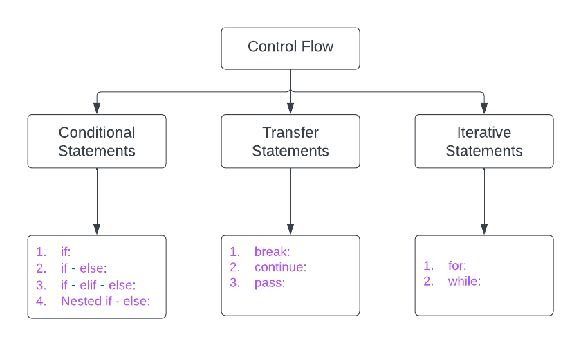

# T1A1-Workbook


## Q1 	**Identify** and **explain** common and important components and concepts of web development markup languages

<br>

### *__Solution__*

<br>

The first thing you see when you go to a particular website is a web page or web document.

These web pages contain Markup Languages such as Hypertext Markup Language (HTML). 
HTML is used to structure and describe the content within these web pages.

An important concept for markup languages such as HTML is that the structure of an HTML document is defined by the nesting of HTML Elements to form a hierarchy.

A HTML Element structure includes a start tag, tag name, an attribute name with an attribute value the element content (the text affected by the tag meaning) and finally the end tag of the element. Elements are either block level elements or inline elements.


```html

<!-- Question needs more work -->

<h1> This is an example of an HTML element </h1>

```

---


## Q2 	**Define** the features of the following technologies that are essential in terms of the development of the internet:
 - packets
 - IP addresses (IPv4 and IPv6)
 - routers and routing
 - domains and DNS

> **Explain** how each technology has contributed to the development of the internet.

<br>

### *__Solution__*
```sh
## Q2 solution goes here

```

---

## Q3 	**Define** the features of the following technologies that are essential in terms of the development of the internet:
 - TCP
 - HTTP and HTTPS
 - web browsers (requests, rendering and developer tools)

> **Explain** how each technology has contributed to the development of client and server communication over the internet (50 - 150 words for each technology)

<br>

### *__Solution__*
```sh
## Q3 solution goes here

```

---


## Q4 	**Identify** THREE data structures used in the Python programming language and **explain** the reasons for using each.

<br>

### *__Solution__*
```sh
## Q4 solution goes here

```

---


## Q5 	**Describe** the features of interpreters and compilers and how they are different.

<br>

### *__Solution__*
```sh
## Q5 solution goes here

```

---


## Q6 	**Identify** TWO commonly used programming languages and **explain** the benefits and drawbacks of each.

<br>

### *__Solution__*
```sh
## Q6 solution goes here

```

---

## Q7 	**Identify** TWO ethical issues from the areas below and **discuss** the extent to which an IT professional is ethically responsible in terms of the issue.

List of topics containing ethical issues:
 - access to a user’s personal information (medical, family, financial, personal attributes such as sexuality, religion, or beliefs)
 - intellectual property, copyright, and acknowledgement.
 - criminal acts such as theft, fraud, trafficking and distribution of prohibited substances, terrorism
 - GPS tracking data and other types of metadata, MAC addresses, hardware fingerprints
 - freedom of thought, conscience, speech and the media
 - aggressive sales and marketing practices designed to mislead and deceive consumers
 - trading of shares on the stock exchange OR crypto-currencies

> For each ethical issue identify a source of legal information relating to the ethical issue and discuss whether the law is helpful in assisting a developer to act in an ethical way. (Word count guide: 200 words max)

> Conduct **research** into a case study of **ONE** of the ethical issues you have chosen **discuss** how an ethical IT professional should respond to the case study and how they might mitigate or prevent ethical breaches. (Word count guide: 400 - 600 words)

<br>

### *__Solution__*
```sh
## Q7 solution goes here

```

---

### *__Following questions are Python related__*
---

## Q8 	Explain control flow, using examples from the Python programming language

<br>
Control Flow is a term used in Python to discribe the order in which a Python block of code will be executed.

In Python Control Flow can be divied into the three following categories show in the flow chart below

<br>




### *__Solution__*

### __Conditional Statements__

The following examples show a range of Conditional Statements using a 'Movie World Batman Rollercoster Ride' and an 'BMI calculator.

<br>

### __```if``` statement__

<br>

The ```if``` statement is Pythons most simplest form of a Control Statement.<br>

The ```if``` statement will take the condition in which it will be a evaluated to either ```true``` or ```false```.<br>

Following example shows ```height``` as the condition. If the user's height is greater than or equal to 120 centimetres then the condition is ```true```, and to print the following statement.

if the condition is ```false```, example the user's height is less than 120 centimetres and the condition is ```false``` and the block of code is skipped.
```python
height = 121

# condition: check if user is taller than or equal to 120cm 
if height >= 120:

    # statement: True  height is >= 120 then display this message
    print("Nice! You can ride the Batman rollercoaster, here is a complementary vomit bag")

```

<br>

### __```if-else``` statement__

<br>


The addition of the ```else``` component in the ```if-else``` statement allows Python to catch another condition.  The following example shows the addition of the ```else``` component.

The ```if-else``` statement will check the condition, if the condition evaluates to ```true``` then statement-1 will be executed, if the condition evaluates to ```false``` then statement-2 will be executed.


```python
height = 121

# condition: check if user is taller than or equal to 120cm 
if height >= 120:
    
    # statement-1: True  height is >= 120 then display this message
    print("Nice! You can ride the Batman rollercoaster, here is a complementary vomit bag")
    
    # statement-2: False in all other case (height < 120) display this message
else:
    print("Sorry bud your too short !")
```

<br>

### __```if-elif-else``` statement__

<br>

```python
height = float(input("enter your height in m: "))
weight = float(input("enter your weight in kg: "))
bmi = round(weight / height ** 2)

# condition-1 If BMI is less than 18.5kg
if bmi < 18.5:        

        # statement-1: underweight
        print(f"Your BMI is {bmi}, you are underweight")

# condition-2: If BMI is less than 25kg
elif bmi < 25:        

        # statement-2: normal weight
        print(f"Your BMI is {bmi}, you are in the normal weight range")

# condition-3: If BMI is over 25 but less than 30kg
elif bmi < 30:        

        # statement-3: overweight
        print(f"Your BMI is {bmi}, you are overweight")

# condition-4: If BMI is over 30 but less than 35kg
elif bmi < 35:        

        # statement-4: Fat
        print(f"Your BMI is {bmi}, you are fat!")

# condition n...
        ...    
        # you can add as many elif statements as you like, but they
        # must be within the 'if-else' condition.

# all other conditions: If BMI is less than 35 => 
else:      
    
    # statement: Super Fat
    print(f"Your BMI is {bmi}, you are super fat!") 

```

### Nested if-else statement

```python

print("Welcome to the rollercoaster")

height = int(input("What is your height in cm ?"))

if height >= 120:
   
    print("You can ride the rollercoaster")
    age = int(input("What is your age ?"))
    
   
    if age < 12:   
        print("That will be $5 dollars please")
    elif age <= 18:     # age is 18 years or younger
        print("That will be $7 dollars please")
        #Note:
        #   1) We can use as many elif statement as we like, BUT must be in the
        #      if-else condition.
    else:       # age is over 18 years old (19 +)
        print("That will be $12 Dollars please")
else:
    print("Sorry bud your too short !")

```

---

## Q9 	Explain the difference between type coercion and type conversion. Are either of these used in Python?

<br>

### *__Solution__*
```sh
## Q9 solution goes here

```

---

## Q10 	Explain data types, using examples

<br>

### *Solution*

<br>

There are many Python Data Types. Four of the basic BUT most important **data types** are: 

*   String (str)
*   integer (int)
*   float ()
*   boolean True / False
> Maybe include the following 2 more data types if I have time
*   Range ()
*   List ()

<br>

### **String (str)**

<br>

The data type ```string``` is a string of characters that are created with double quotes.
The ```string``` data type is useful for Subscripting, which is a method used for pulling
out a particular elements from a string.
<br>

Here are two examples of ```string``` Subscripting:

The number in between the square brackets determines which 
character you're going to pull out.

```python
# E.g. [0] = H, [1] = e, [2] = l etc...

# Example-1
print("Hello"[0])  # [0] output = letter "H"

# Example-2
print("Hello"[4])  # [4] output = letter "o"

```


### **integer (int)**

<br>

The data type ```integer``` refers to a number with no decimal places (whole number). The ```int``` data type is usefull for math operations

Example: Math operation - adding integers 
```python
print(123 + 345)
# output = 468
# - Dont use qoutations("") when declearing Integers.

print(123_456_789) 
# output = 123456789
# - Use underscore(_) for when visualizing large numbers in code.
# - The computer will remove the underscores, and display the number as
#   if it was concatenated.
```
Example: Concatenating integers("string")
```python
print("123" + "345")
# output = 123345
# Important: Anything inside quotations(" ") is just text (string).
```

### **Floating-Point Number (float)**

```python
3.14159 # PI
3141.59
734_529.678

# - Floating-Point Number (Float).
# - The decimal point can float around a number because it could occur
#   at any point in the number.
```

### **Boolean (True/False)**

```python
True
False

# - Booleans have only two values:
#       1) True
#       2) False
# - Booleans start with capital letters T/F
# - No quotation marks
# - Booleans used to test if something is True / False and for your
#   program to respond accordingly.
```


---

## Q11 	Here’s the problem: “There is a restaurant serving a variety of food. The customers want to be able to buy food of their choice. All the staff just quit, how can you build an app to replace them?”
 - Identify the classes you would use to solve the problem
 - Write a short explanation of why you would use the classes you have identified

### *__Solution__*
```sh
## 11 solution goes here

```

---

## Q12 	Identify and explain the error in the code snippet below that is preventing correct execution of the program

```python
celsius = input()
fahrenheit = (celsius * 9/5)+32
print(f"The result is: {fahrenheit}.")
```

### *__Solution__*

In Python, all inputs are Strings regardless of wether the user inputs a number
or a letter.

```python
# Include int function to change input String to Interger 
celsius = int(input()) # Str

# Missing ( ; ) at end of statement
fahrenheit = (celsius * 9/5)+32; # int

print(f"The result is: {fahrenheit}.")

# input = 30 degrees
# output = 86.0 fahrenheit
```

---

## Q13 	The code snippet below looks for the first two elements that are out of order and swaps them; however, it is not producing the correct results. Rewrite the code so that it works correctly.

```python
arr = [5, 22, 29, 39, 19, 51, 78, 96, 84]
i = 0
while (i< arr.len() -1) and (arr[i] < arr[i+1]):
    i += i
print (i)
    arr[i] = arr[i+1]
    arr[i+1] = arr[i]
```


### *__Solution__*
```sh
## 13 solution goes here

```

---

## Q14 	Demonstrate your algorithmic thinking through completing the following two tasks, in order:
 1. Create a flowchart to outline the steps for listing all prime numbers between 1 and 100 (inclusive). Your flowchart should make use of standard conventions for flowcharts to indicate processes, tasks, actions, or operations
 2. Write pseudocode for the process outlined in your flowchart

<br>

### *__Solution__*
```sh
## 14 solution goes here

```

---

## Q15 	Write pseudocode OR Python code for the following problem:
*You have access to two variables: raining (boolean) and temperature (integer). If it’s raining and the temperature is less than 15 degrees, print to the screen “It’s wet and cold”, if it is less than 15 but not raining print “It’s not raining but cold”. If it’s greater than or equal to 15 but not raining print “It’s warm but not raining”, and otherwise tell them “It’s warm and raining”*.

<br>

### *__Solution__*
```sh
## 15 solution goes here

```

---

## Q16 	ACME Corporation are hiring a new junior developer, as part of their hiring criteria they've created a "coding skill score" based on the specific competencies they require for this role; the more important the skill is for ACME corp, the more points it contributes to the "coding skill score" The skills are weighted as follows:
- Python (1)
- Ruby (2)
- Bash (4)
- Git (8)
- HTML (16)
- TDD (32)
- CSS (64)
- JavaScript (128)

<br>

>### **Write a program that allows a user to input their skills and then tells them:**

- a)Their overall "coding skill score" 
- b) Skills they may want to learn, and how much each one would improve their score

<br>

### *__Solution__*
```sh
## 16 solution goes here

```

---